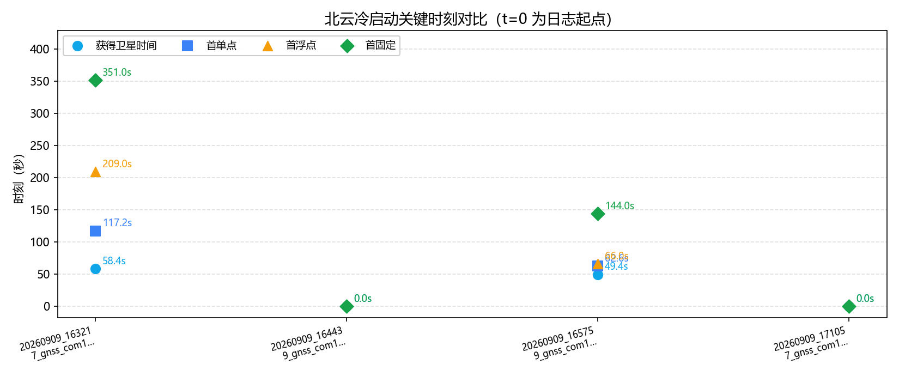
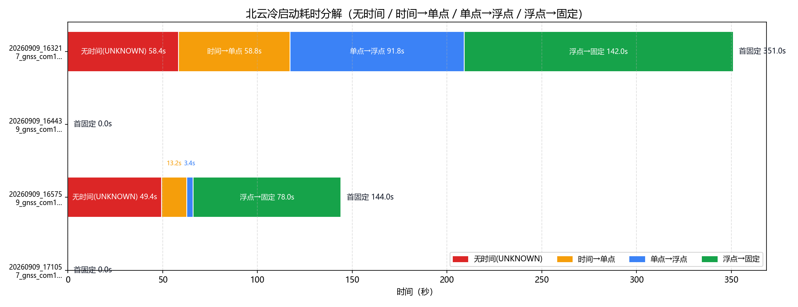
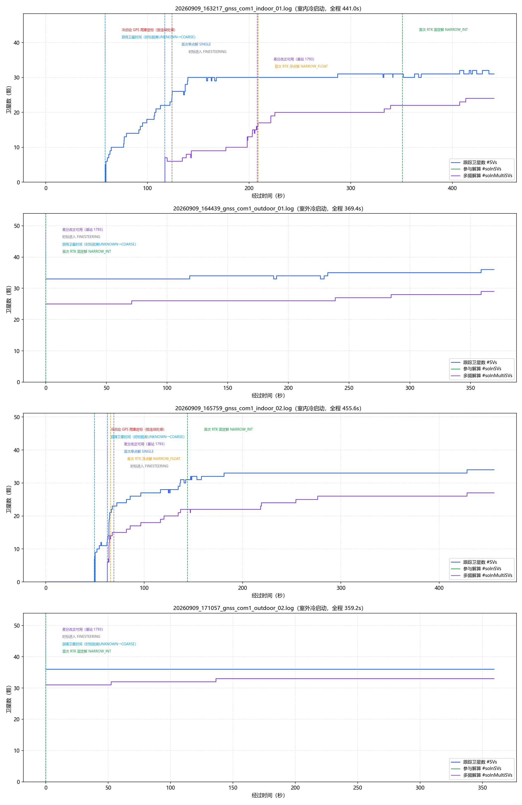

# 北云（UG016）GNSS 冷启动策略分析（室内 / 室外冷启动）

- 数据源：`20260909_163217_gnss_com1_indoor_01.log`、`20260909_164439_gnss_com1_outdoor_01.log`、`20260909_165759_gnss_com1_indoor_02.log`、`20260909_171057_gnss_com1_outdoor_02.log`（COM1 ASCII 日志，BESTGNSSPOSA 5Hz）
- 口径依据：北云科技《UG016 数据通信接口协议》（文本转录：`by_manual\UG016.md`）
- 分析维度：时标状态 / 解算状态 / 定位类型 / 卫星数；本报告不含 INS

## 一、数据完整性与报文构成

| 文件 | 时长 | 定位报文 | 实测周期 | 时标分布(条) | 定位类型分布(条) | 间断/重定标 |
|---|---|---|---|---|---|---|
| `20260909_163217_gnss_com1_indoor_01.log` | 441.0s | BESTGNSSPOSA 2206条；BESTPOSA 4414条 | 0.2s/5.0Hz | `{'UNKNOWN': 292, 'COARSE': 329, 'FINESTEERING': 1585}` | `{'NONE': 586, 'SINGLE': 459, 'NARROW_FLOAT': 710, 'NARROW_INT': 451}` | 0 / 1 |
| `20260909_164439_gnss_com1_outdoor_01.log` | 369.4s | BESTGNSSPOSA 1848条；BESTPOSA 3696条 | 0.2s/5.0Hz | `{'FINESTEERING': 1848}` | `{'NARROW_INT': 1848}` | 0 / 0 |
| `20260909_165759_gnss_com1_indoor_02.log` | 455.6s | BESTGNSSPOSA 2279条；BESTPOSA 4560条 | 0.2s/5.0Hz | `{'UNKNOWN': 247, 'COARSE': 99, 'FINESTEERING': 1933}` | `{'NONE': 313, 'SINGLE': 17, 'NARROW_FLOAT': 1913, 'NARROW_INT': 36}` | 0 / 1 |
| `20260909_171057_gnss_com1_outdoor_02.log` | 359.2s | BESTGNSSPOSA 1797条；BESTPOSA 3594条 | 0.2s/5.0Hz | `{'FINESTEERING': 1797}` | `{'NARROW_INT': 1797}` | 0 / 0 |

> 口径（UG016）：报文按行做 CRC 校验（`#` 开头为 32 位 CRC，`$` 开头为 NMEA 异或）；`$KSXT` 为自定义 8 位 CRC32 私有报文，按 NMEA 异或校验判失败属正常、非故障。卫星维度口径：#SVs=跟踪卫星数、#solnSVs=参与解算卫星数、#solnMultiSVs=参与解算的多频卫星数。

### 报文完整性与周期（按报头时间戳逐帧判定）

| 文件 | 帧数 | 实测周期 | 标称频率 | CRC失败行 | 真实间断 | 周重定标 |
|---|---|---|---|---|---|---|
| `20260909_163217_gnss_com1_indoor_01.log` | 2206 | 0.2s | 5.0Hz | 4397 | 0 | 1 |
| `20260909_164439_gnss_com1_outdoor_01.log` | 1848 | 0.2s | 5.0Hz | 3684 | 0 | 0 |
| `20260909_165759_gnss_com1_indoor_02.log` | 2279 | 0.2s | 5.0Hz | 4540 | 0 | 1 |
| `20260909_171057_gnss_com1_outdoor_02.log` | 1797 | 0.2s | 5.0Hz | 3581 | 0 | 0 |

> 实测周期 = 全部相邻帧报头时间差的中位数（不假设）；真实间断 = 相邻帧时间差 > 2.5×实测周期（保留在时间轴中）；周重定标 = 相邻帧时间差 > 3600s（按时间连续处理）。

## 二、四个关键时刻（秒）

| 文件 | 获得卫星时间(脱离UNKNOWN) | COARSE→FINE | 差分改正可用 | 首单点 | 首浮点 | 首固定 | 无解/单点/浮点/固定 占比% | 跟踪星 min/均值/max |
|---|---|---|---|---|---|---|---|---|
| `20260909_163217_gnss_com1_indoor_01.log` | **58.4s** | 58.4s → 124.2s | 208.0s | 117.2s | 209.0s | **351.0s** | 26.6/20.8/32.2/20.4 | 0/24.1/32 |
| `20260909_164439_gnss_com1_outdoor_01.log` | **0.0s** | — → 0.0s | 0.0s | — | — | **0.0s** | 0/0/0/100.0 | 33/34.1/36 |
| `20260909_165759_gnss_com1_indoor_02.log` | **49.4s** | 49.4s → 69.2s | 62.6s | 62.6s | 66.0s | **144.0s** | 13.7/0.7/83.9/1.6 | 0/27.5/34 |
| `20260909_171057_gnss_com1_outdoor_02.log` | **0.0s** | — → 0.0s | 0.0s | — | — | **0.0s** | 0/0/0/100.0 | 36/36/36 |

## 三、冷启动耗时分解

| 文件 | 无时间 | 时间→单点 | 单点→浮点 | 浮点→固定 | 合计到首固定 | 差分数据可用 |
|---|---|---|---|---|---|---|
| `20260909_163217_gnss_com1_indoor_01.log` | 58.4s | 58.8s | 91.8s | 142.0s | **351.0s** | 208.0s |
| `20260909_164439_gnss_com1_outdoor_01.log` | 0.0s | — | — | — | **0.0s** | 0.0s |
| `20260909_165759_gnss_com1_indoor_02.log` | 49.4s | 13.2s | 3.4s | 78.0s | **144.0s** | 62.6s |
| `20260909_171057_gnss_com1_outdoor_02.log` | 0.0s | — | — | — | **0.0s** | 0.0s |

## 四、定位类型分段统计

### `20260909_163217_gnss_com1_indoor_01.log`

| 定位类型段 | 起–止(s) | 时长(s) | 条数 | 跟踪星 | 解算星 | 多频解算 |
|---|---|---|---|---|---|---|
| NONE | 0.0–117.0 | 117.0 | 586 | 7.3 | 0 | 0 |
| SINGLE | 117.2–208.8 | 91.6 | 459 | 28.7 | 9.2 | 9.2 |
| NARROW_FLOAT | 209.0–350.8 | 141.8 | 710 | 30.4 | 19.9 | 19.9 |
| NARROW_INT | 351.0–441.0 | 90.0 | 451 | 31.0 | 22.7 | 22.7 |

### `20260909_164439_gnss_com1_outdoor_01.log`

| 定位类型段 | 起–止(s) | 时长(s) | 条数 | 跟踪星 | 解算星 | 多频解算 |
|---|---|---|---|---|---|---|
| NARROW_INT | 0.0–369.4 | 369.4 | 1848 | 34.1 | 26.4 | 26.4 |

### `20260909_165759_gnss_com1_indoor_02.log`

| 定位类型段 | 起–止(s) | 时长(s) | 条数 | 跟踪星 | 解算星 | 多频解算 |
|---|---|---|---|---|---|---|
| NONE | 0.0–62.4 | 62.4 | 313 | 2.2 | 0 | 0 |
| SINGLE | 62.6–65.8 | 3.2 | 17 | 17 | 9.7 | 9.7 |
| NARROW_FLOAT | 66.0–143.8 | 77.8 | 390 | 26.7 | 18.0 | 18.0 |
| NARROW_INT | 144.0–151.0 | 7.0 | 36 | 31.4 | 21.9 | 21.9 |
| NARROW_FLOAT | 151.2–455.6 | 304.4 | 1523 | 33.0 | 24.9 | 24.9 |

### `20260909_171057_gnss_com1_outdoor_02.log`

| 定位类型段 | 起–止(s) | 时长(s) | 条数 | 跟踪星 | 解算星 | 多频解算 |
|---|---|---|---|---|---|---|
| NARROW_INT | 0.0–359.2 | 359.2 | 1797 | 36 | 32.5 | 32.5 |

## 附录：口径与手册条款对应

| 报告字段 | 数据来源 | 手册条款 | 说明 |
|---|---|---|---|
| 获得卫星时间 | BESTGNSSPOSA 报头 Time Status 首次脱离 UNKNOWN | 报头字段 6 | UNKNOWN 表明尚未计算出准确的 GPS 时间 |
| COARSE→FINE | Time Status 首次 COARSE / FINESTEERING | 报头字段 6 | UNKNOWN / COARSE / FINESTEERING 三态 |
| 首单点 / 首浮点 / 首固定 | 位置类型 Pos Type 首次 SINGLE / NARROW_FLOAT / NARROW_INT | 表 4-2 | SINGLE=16 单点解；NARROW_FLOAT=34 窄带浮点解；NARROW_INT=50 窄带固定解 |
| 差分改正可用 | Stn ID 非空且 != "0" | 4.2.2 字段 12 | 差分站台 ID 号；单点定位时 ID 为 0；基站 ID 随数据动态变化 |
| 无解段解算状态 | Sol Type = INSUFFICIENT_OBS / VARIANCE | 表 4-1 | 观测量不足 / 方差超过限值；SOL_COMPUTED=完全解算；COLD_START=冷启动尚未完全解算 |
| 跟踪星 / 解算星 / 多频解算 | #SVs / #solnSVs / #solnMultiSVs | 4.2.2 字段 15/16/18 | 跟踪卫星数 / 解算卫星数 / 多频解算卫星数 |

> 时间轴为录制经过时间（t=0 为各日志首条记录）；若出现冷启动 GPS 周重定标（相邻两条报头时间差 >3600s），按时间连续处理（间隔按标称周期计）。