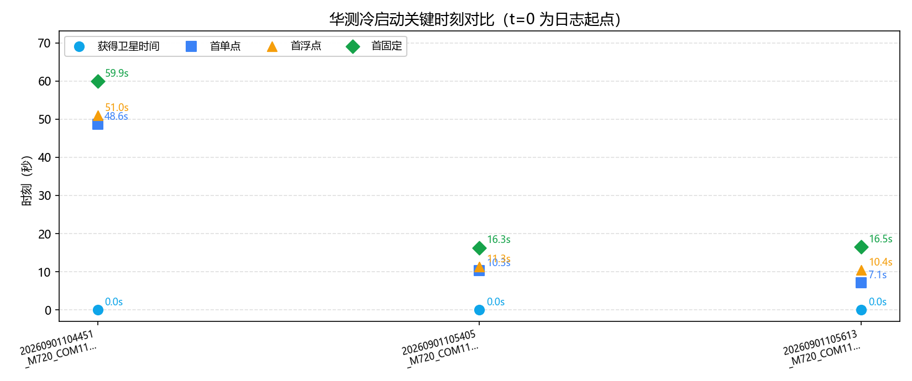
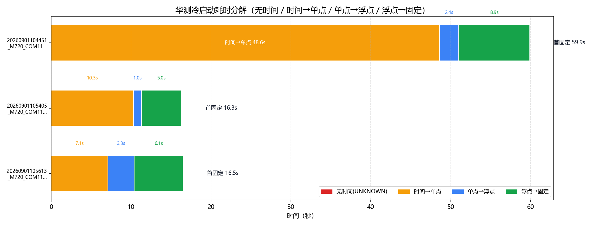
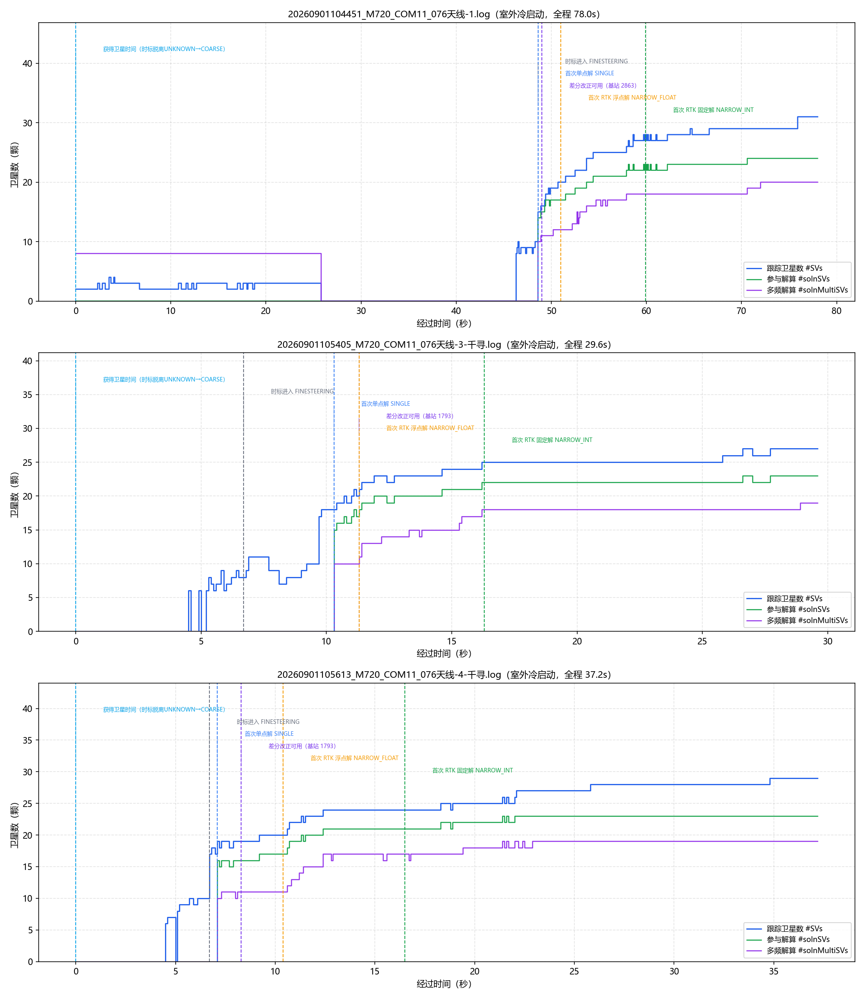

# 华测（HUACE M720）GNSS 冷启动策略分析（室内 / 室外冷启动）

- 数据源：`20260901104451_M720_COM11_076天线-1.log`、`20260901105405_M720_COM11_076天线-3-千寻.log`、`20260901105613_M720_COM11_076天线-4-千寻.log`（COM1 ASCII 日志，#BESTPOSA）
- 口径依据：华测《M7系列模组用户指令及协议手册 V2.7》（`huace_manual\M7系列模组用户指令及协议手册_V2.7.pdf`）
- 分析维度：时标状态 / 解算状态 / 定位类型 / 卫星数；本报告不含 INS

## 一、数据完整性与报文构成

| 文件 | 时长 | 定位报文 | 实测周期 | 时标分布(条) | 定位类型分布(条) | 间断/重定标 |
|---|---|---|---|---|---|---|
| `20260901104451_M720_COM11_076天线-1.log` | 78.0s | BESTPOSA 632条 | 0.1s/10.0Hz | `{'COARSESTEERING': 191, 'APPROXIMATE': 146, 'FINESTEERING': 295}` | `{'NONE': 337, 'SINGLE': 4, 'PSRDIFF': 30, 'NARROW_FLOAT': 79, 'NARROW_INT': 182}` | 2 / 0 |
| `20260901105405_M720_COM11_076天线-3-千寻.log` | 29.6s | BESTPOSA 297条 | 0.1s/10.0Hz | `{'APPROXIMATE': 67, 'FINESTEERING': 230}` | `{'NONE': 103, 'SINGLE': 10, 'NARROW_FLOAT': 47, 'PSRDIFF': 3, 'NARROW_INT': 134}` | 0 / 0 |
| `20260901105613_M720_COM11_076天线-4-千寻.log` | 37.2s | BESTPOSA 371条 | 0.1s/10.0Hz | `{'APPROXIMATE': 65, 'FINESTEERING': 306}` | `{'NONE': 69, 'SINGLE': 12, 'PSRDIFF': 25, 'NARROW_FLOAT': 57, 'NARROW_INT': 208}` | 1 / 0 |

> 口径（华测 M7 手册）：报文按行做 CRC 校验（`#` 开头为 32 位 CRC，`$` 开头为 NMEA 异或）。卫星维度口径：#SVs=跟踪到的卫星数、#solnSVs=参与解算的卫星数、#solnMultiSVs=参与解算的多频信号卫星数（含义与单位同北云）。

### 报文完整性与周期（按报头时间戳逐帧判定）

| 文件 | 帧数 | 实测周期 | 标称频率 | CRC失败行 | 真实间断 | 周重定标 |
|---|---|---|---|---|---|---|
| `20260901104451_M720_COM11_076天线-1.log` | 632 | 0.1s | 10.0Hz | 0 | 2 | 0 |
| `20260901105405_M720_COM11_076天线-3-千寻.log` | 297 | 0.1s | 10.0Hz | 0 | 0 | 0 |
| `20260901105613_M720_COM11_076天线-4-千寻.log` | 371 | 0.1s | 10.0Hz | 0 | 1 | 0 |

> 实测周期 = 全部相邻帧报头时间差的中位数（不假设）；真实间断 = 相邻帧时间差 > 2.5×实测周期（保留在时间轴中）；周重定标 = 相邻帧时间差 > 3600s（按时间连续处理）。

## 二、四个关键时刻（秒）

| 文件 | 获得卫星时间(脱离UNKNOWN) | COARSE→FINE | 差分改正可用 | 首单点 | 首浮点 | 首固定 | 无解/单点/浮点/固定 占比% | 跟踪星 min/均值/max |
|---|---|---|---|---|---|---|---|---|
| `20260901104451_M720_COM11_076天线-1.log` | **0.0s** | — → 48.6s | 49.0s | 48.6s | 51.0s | **59.9s** | 53.3/5.4/12.5/28.8 | 0/13.5/31 |
| `20260901105405_M720_COM11_076天线-3-千寻.log` | **0.0s** | — → 6.7s | 11.3s | 10.3s | 11.3s | **16.3s** | 34.7/4.4/15.8/45.1 | 0/17.8/27 |
| `20260901105613_M720_COM11_076天线-4-千寻.log` | **0.0s** | — → 6.7s | 8.3s | 7.1s | 10.4s | **16.5s** | 18.6/10.0/15.4/56.1 | 0/21.4/29 |

## 三、冷启动耗时分解

| 文件 | 无时间 | 时间→单点 | 单点→浮点 | 浮点→固定 | 合计到首固定 | 差分数据可用 |
|---|---|---|---|---|---|---|
| `20260901104451_M720_COM11_076天线-1.log` | 0.0s | 48.6s | 2.4s | 8.9s | **59.9s** | 49.0s |
| `20260901105405_M720_COM11_076天线-3-千寻.log` | 0.0s | 10.3s | 1.0s | 5.0s | **16.3s** | 11.3s |
| `20260901105613_M720_COM11_076天线-4-千寻.log` | 0.0s | 7.1s | 3.3s | 6.1s | **16.5s** | 8.3s |

## 四、定位类型分段统计

### `20260901104451_M720_COM11_076天线-1.log`

| 定位类型段 | 起–止(s) | 时长(s) | 条数 | 跟踪星 | 解算星 | 多频解算 |
|---|---|---|---|---|---|---|
| NONE | 0.0–48.5 | 48.5 | 337 | 2.0 | 0 | 4.5 |
| SINGLE | 48.6–48.9 | 0.3 | 4 | 15.2 | 14.2 | 10.2 |
| PSRDIFF | 49.0–50.9 | 1.9 | 20 | 18.4 | 16.6 | 11.4 |
| NARROW_FLOAT | 51.0–51.2 | 0.2 | 3 | 20 | 17 | 12 |
| PSRDIFF | 51.3–52.0 | 0.7 | 8 | 20.8 | 17.8 | 12 |
| NARROW_FLOAT | 52.1–52.5 | 0.4 | 5 | 21.2 | 18.2 | 12.8 |
| PSRDIFF | 52.6–52.6 | 0.0 | 1 | 22 | 19 | 13 |
| NARROW_FLOAT | 52.7–54.1 | 1.4 | 15 | 22.7 | 19.3 | 15.1 |
| PSRDIFF | 54.2–54.2 | 0.0 | 1 | 24 | 20 | 16 |
| NARROW_FLOAT | 54.3–59.8 | 5.5 | 56 | 25.6 | 21.4 | 17.2 |
| NARROW_INT | 59.9–78.0 | 18.1 | 182 | 28.8 | 23.3 | 18.7 |

### `20260901105405_M720_COM11_076天线-3-千寻.log`

| 定位类型段 | 起–止(s) | 时长(s) | 条数 | 跟踪星 | 解算星 | 多频解算 |
|---|---|---|---|---|---|---|
| NONE | 0.0–10.2 | 10.2 | 103 | 4.9 | 0 | 0 |
| SINGLE | 10.3–11.2 | 0.9 | 10 | 19.4 | 16.4 | 10 |
| NARROW_FLOAT | 11.3–11.5 | 0.2 | 3 | 21.7 | 18.7 | 12.3 |
| PSRDIFF | 11.6–11.6 | 0.0 | 1 | 22 | 19 | 13 |
| NARROW_FLOAT | 11.7–11.8 | 0.1 | 2 | 22 | 19 | 13 |
| PSRDIFF | 11.9–11.9 | 0.0 | 1 | 23 | 20 | 13 |
| NARROW_FLOAT | 12.0–12.2 | 0.2 | 3 | 23 | 20 | 13.3 |
| PSRDIFF | 12.3–12.3 | 0.0 | 1 | 23 | 20 | 14 |
| NARROW_FLOAT | 12.4–16.2 | 3.8 | 39 | 23.4 | 20.4 | 15.3 |
| NARROW_INT | 16.3–29.6 | 13.3 | 134 | 25.5 | 22.2 | 18.1 |

### `20260901105613_M720_COM11_076天线-4-千寻.log`

| 定位类型段 | 起–止(s) | 时长(s) | 条数 | 跟踪星 | 解算星 | 多频解算 |
|---|---|---|---|---|---|---|
| NONE | 0.0–7.0 | 7.0 | 69 | 3.4 | 0 | 0 |
| SINGLE | 7.1–8.2 | 1.1 | 12 | 18.8 | 15.8 | 10.8 |
| PSRDIFF | 8.3–10.3 | 2.0 | 21 | 19.6 | 16.6 | 11 |
| NARROW_FLOAT | 10.4–10.4 | 0.0 | 1 | 20 | 17 | 11 |
| PSRDIFF | 10.5–10.5 | 0.0 | 1 | 20 | 17 | 11 |
| NARROW_FLOAT | 10.6–10.7 | 0.1 | 2 | 21.5 | 18.5 | 12 |
| PSRDIFF | 10.8–10.8 | 0.0 | 1 | 22 | 19 | 13 |
| NARROW_FLOAT | 10.9–11.5 | 0.6 | 7 | 22.3 | 19.3 | 13.9 |
| PSRDIFF | 11.6–11.6 | 0.0 | 1 | 23 | 20 | 15 |
| NARROW_FLOAT | 11.7–11.9 | 0.2 | 3 | 23 | 20 | 15 |
| PSRDIFF | 12.0–12.0 | 0.0 | 1 | 23 | 20 | 15 |
| NARROW_FLOAT | 12.1–16.4 | 4.3 | 44 | 23.9 | 20.9 | 16.8 |
| NARROW_INT | 16.5–37.2 | 20.7 | 208 | 27.1 | 22.7 | 18.6 |

## 附录：口径与手册条款对应

| 报告字段 | 数据来源 | 手册条款 | 说明 |
|---|---|---|---|
| 获得卫星时间 | #BESTPOSA 报头 Time Status 首次脱离 UNKNOWN | 表3-19 | UNKNOWN=0 时间有效性未知；数据中出现的 APPROXIMATE/COARSESTEERING 均属"已脱离 UNKNOWN" |
| COARSE→FINE | Time Status 首次进入 COARSE 系（COARSE/COARSESTEERING）/ FINE 系（FINE/FINESTEERING） | 表3-19 | COARSESTEERING=4 粗调调优中；FINESTEERING=9 已正确配置且调优中 |
| 首单点 / 首浮点 / 首固定 | 定位类型 Pos Type 首次 SINGLE / NARROW_FLOAT / NARROW_INT | 表3-40 | SINGLE=1 单点定位；NARROW_FLOAT=5 窄巷浮点解；NARROW_INT=4 窄巷固定解 |
| 差分改正可用 | Stn ID 非空且 != "0" | 3.2.14 字段24 | 基准站 ID（实测为十进制字符串，如 "1793"）；单点定位时为空串 |
| 无解段解算状态 | Sol Type = INSUFFICIENT_OBS / VARIANCE / NO_CONVERGENCE | 表3-39 | 观测数据不足 / 方差超过限制 / 无法收敛；SOL_COMPUTED=已解出 |
| 跟踪星 / 解算星 / 多频解算 | #SVs / #solnSVs / #solnMultiSVs | 3.2.14 字段15/16/17 | 跟踪到的卫星数 / 参与解算的卫星数 / 参与解算的多频信号卫星数（含义与单位同北云） |

> 时间轴为录制经过时间（t=0 为各日志首条记录）；若出现冷启动 GPS 周重定标（相邻两条报头时间差 >3600s），按时间连续处理（间隔按标称周期计）。